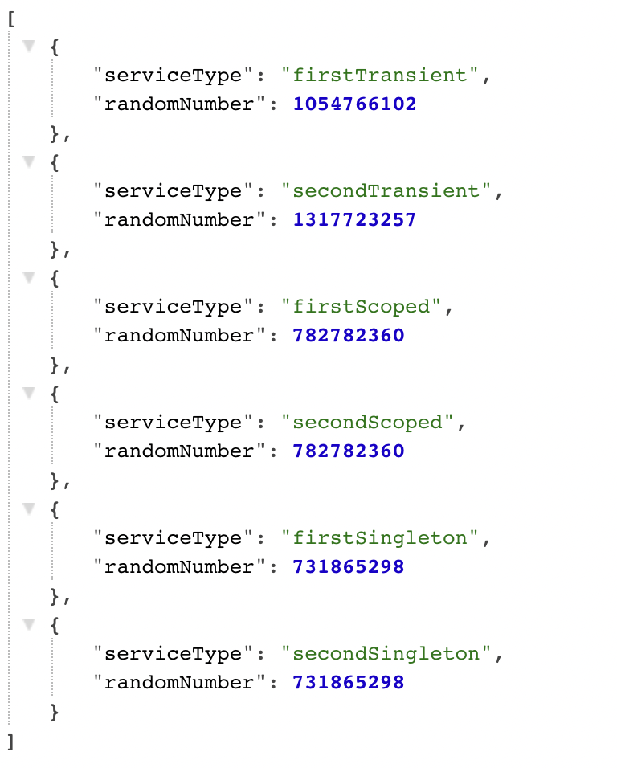
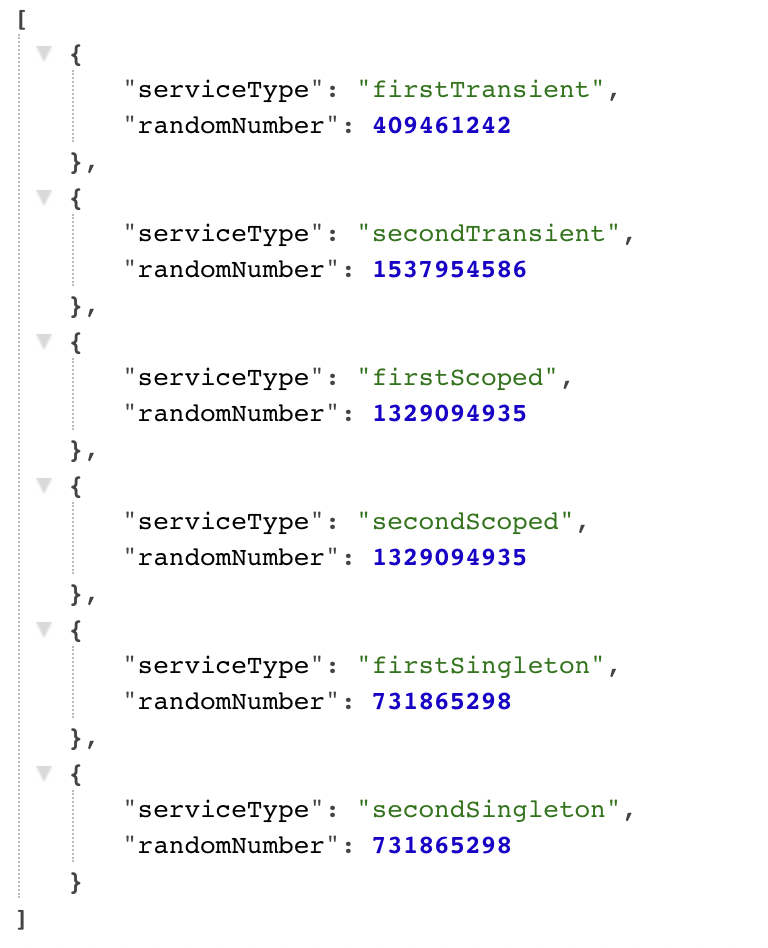

# Dependency Injection Lifetime Example
Bu projede Singleton, Scoped ve Transient lifetime ları ele alacağız. Birbirlerinden farklarını aşşağıda anlatacağım.

## Genel Bakış

### Singleton
- Singleton için uygulama ayağa kalktığı anda bir instance oluşturulur ve her istek için bu instance kullanılır.

### Scoped
- Scoped için her istek geldiği anda bir instance oluşturulur ve yeni istek gelene kadar bu instance kullanılır.

### Transient
- Transient için her instance çağrıldığında yeni bir instance oluşturulur.

## Proje içerisindeki Bakış
Proje kapsamında minimal api kullanılmıştır, SingletonService bir ISingletonService, ScopedService bir IScopedService ve TransientService bir ITransientService sırası ile implementasyonları olarak ve configurasyonları sırası ile AddSingleton, AddScoped, AddTransient olarak ele alınmıştır.

Her servis için RandomNumber propu tanımlanmış instance oluşuturulur oluşturulmaz constructor yapısında bu propa Random ile bir değer atanmıştır.

Tam olarak farklılıklarının rahat anlaşılabilmesi için root patterna("/") bir get isteği geldiği anda ISingletonService den 2 adet, IScopedService den 2 adet ve ITransientService den 2 adet, toplamda 3 interface için 6 adet instance geldiğini simüle ettim ve sonuclar aşşağıdaki gibi çıktı.

## Sonuçlar

- Ilk istekte resimden de anlaşılacağı üzere transient 2 instance için 2 farklı sayı getirirken, hem scoped hemde singleton 2 instance için 2 sayıyıda aynı getirdi. Burada transient farkını anlamış olduk peki ya scoped ve singleton için durum nedir ? Hadi bir kere daha istek atalım.

- Ikinci istekte görüldüğü üzere transient zaten farklı getiriken, scoped 2 sini yine aynı getirdi ama işe bakın ki ilk istekteki verilerden farklı peki singleton için durum ne genel bakışta anlattıgım gibi uygulama ayağa kalktıgı anda zaten yaratılan instance hiç değişmiyor.

